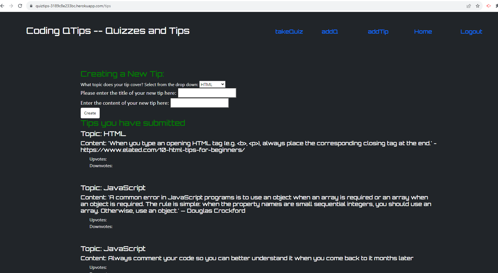

# Coding Quizzes and Tips

## Description

      The coding quizzes and tips is an application to provide opportunities for people to learn coding and sharpen their skills,  and to provide tips to help new coders prepare for interviews, expand their coding knowledge, etc…

## Table of Contents

[Installation Instructions](#installation-instructions) 
[Usage](#usage) 
[License](#license) 
[Contributors](#contributors) 
[Tests](#tests) 
[Questions](#questions) 

## Installation Instructions

      To install the required packages to run this app locally, navigate to the root directory of the project and open an integrated terminal.  Type <strong> npm i -y</strong> in the terminal and enter.  This will install the packages listed in the package manager, including inquirer v8.2.4.

## Usage

      To run the app locally, type node server.js in the terminal and enter.
       To run the app in the browser: click on the link below
      https://quiztips-3189c8e233bc.herokuapp.com/

## License

    This project is covered under the MIT license.

## Contributors

Jacqueline Stiehl at <https://github.com/Jacqueline-Stiehl>

Michael Engstrand at <https://github.com/mikeengstrand>

Chris Gruenhagen at <https://github.com/ChristyGruen>

Samuel Levine at <https://github.com/toxicmix>

Henrich Michlitsch at <https://github.com/Henrichm77>

Help from University of Minnesota coding camp instructor Gary Almes and TAs Katy Vincent and Austin Slater.

## Screenshot

#### How to Contribute

      To contribute to the app: fork the repo on GitHub, then clone the project to your own machine.  Update the code, commit your changes to your own branch, then push your work to your fork on GitHub. Finally, submit a Pull request for review.

## Tests

      none

## Questions

For further information, access the gitHub profile here:
<https://github.com/ChristyGruen>
 
For questions, comments and concerns, contact us here:
<none>
